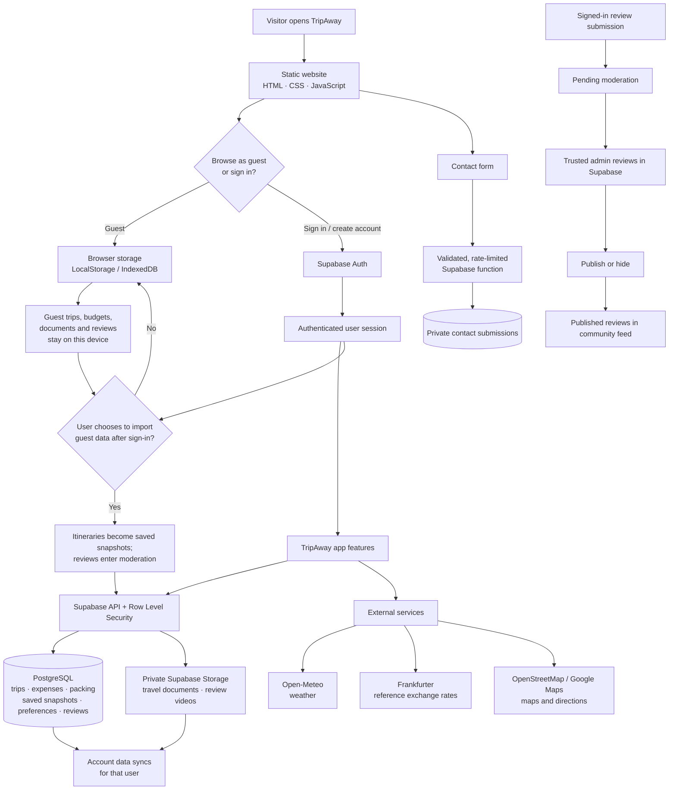

# TripAway

**A travel discovery and trip-planning web app for exploring destinations, organizing itineraries, and sharing travel experiences.**

TripAway combines a public tourism website with an interactive, mobile-style app preview. It is built with plain HTML, CSS, and JavaScript, and uses Supabase for account-backed features. The site can be browsed as a guest; signing in enables private account sync.

## Project at a glance

| Area | Technology / responsibility |
| --- | --- |
| Frontend | HTML, CSS, and vanilla JavaScript; no build step or frontend framework |
| Authentication and database | Supabase Auth and PostgreSQL |
| Authorization | Supabase Row Level Security (RLS) policies restrict private records to their owner |
| File storage | Supabase Storage for private travel documents and optional review videos |
| Guest storage | Browser local storage and IndexedDB on the current device |
| External data | Open-Meteo weather, Frankfurter currency rates, OpenStreetMap map previews, and Google Maps directions |
| Offline shell | Service worker caches the app shell when served over HTTPS or localhost |

## Features

### Website and discovery

- Tourism landing page with destination discovery and curated place cards.
- Destination search and category, indicative-spend, and approximate-distance filters.
- Destination content for Jaipur, Mumbai, Delhi, Coorg, Hampi, Gokarna, Ziro, Tawang, Mechuka, Majuli, Mandu, Orchha, Munnar, Kutch, and Dzukou Valley.
- Responsive layout and multilingual navigation.

### Seven app-preview sections

1. **Discover & map** — Browse places, view planned stops on an OpenStreetMap preview, open Google Maps directions, and find emergency-related searches for India.
2. **My trips** — Build a 1–3 day itinerary, save snapshots, share an itinerary link, print or save as PDF, manage a packing checklist, and store travel documents.
3. **Budget & expenses** — Set a trip budget and split shared expenses across travellers.
4. **Today’s plan** — Browse sample day plans by city and travel style, with current conditions from Open-Meteo.
5. **Community & reviews** — Submit written reviews; video is optional. Signed-in reviews wait for moderation before public display.
6. **Travel translator** — Use an offline phrasebook with speak and copy actions. Phrase translations are included for English, Hindi, Spanish, French, German, Arabic, Portuguese, Japanese, and Chinese.
7. **Currency converter** — Convert INR, USD, EUR, GBP, JPY, SGD, CAD, AUD, and CHF using Frankfurter reference rates.

The interface offers more than 60 language choices, remembers the selected language, and supports right-to-left layout where applicable.

## How the app works

The following flow shows the main user and data paths. GitHub renders Mermaid diagrams in the README.



### Account data and privacy

- Supabase Auth handles account creation and sign-in.
- Signed-in accounts can sync their active itinerary, budget and expenses, packing checklist, saved trip snapshots, and interface preferences.
- Row Level Security limits account data to its owner. The browser uses only the public Supabase anon/publishable key; never place a service-role key in frontend code.
- Travel documents and optional review videos use private storage buckets. Signed links are created for authorized access.
- Guest data remains local unless the user explicitly chooses the one-time import offer after signing in. Import adds trips as saved snapshots without replacing the active account trip; imported reviews are pending moderation. The original guest copy remains on the device.
- Signed-in reviews are not public until a trusted administrator changes their status in Supabase.
- Contact messages are accepted through a server-side function with input validation and a per-email submission limit.

### Service and demo limitations

- Localhost is accessible only on the computer running the server. To share the site with other people or open it remotely on a phone, deploy the frontend to a public static web host.
- Maps, directions, weather, and exchange rates require an internet connection. Currency results are daily reference estimates, not live trading prices. Map tiles are not cached for offline use.
- The planner provides sample itineraries; TripAway does not book travel, take payments, or act as an emergency-response service.
- Review moderation is performed manually in Supabase; the app does not include an administrator dashboard.
- Guest documents are held in browser IndexedDB on the current device. Keep another copy of important documents.

## Run locally on Windows

1. Double-click [`Run-TripAway.bat`](./Run-TripAway.bat) in the project folder.
2. The launcher starts the local server if needed and opens **http://127.0.0.1:8125/**.
3. Keep the separate **TripAway Local Server** console window open while using the site. Close it to stop the server.

The launcher requires Python 3 on PATH. Alternatively, open PowerShell in this folder and run:

```powershell
python -m http.server 8125 --bind 127.0.0.1
```

Then visit `http://127.0.0.1:8125/`. Opening `index.html` directly works for basic browsing, but service workers require HTTPS or localhost.

## Supabase setup

The SQL migrations are in [`supabase/migrations/`](./supabase/migrations/). Apply them in filename order in the Supabase SQL Editor:

1. `20261007195000_initial_schema.sql` — account profiles, active trips, stops, expenses, packing items, reviews, document metadata, RLS, and private storage buckets.
2. `20261007204500_saved_trip_snapshots.sql` — saved itinerary snapshots.
3. `20261007210000_contact_submissions.sql` — contact-message storage and validated, rate-limited submission function.
4. `20261008210000_user_preferences.sql` — account-scoped language and planner preferences.

Then configure [`supabase-config.js`](./supabase-config.js) with the project URL and **public anon/publishable key only**. Configure the project's email-confirmation and allowed redirect URL settings for the site origin. When deploying, add the production URL to Supabase Auth's allowed redirect URLs as well.

## Project structure

| Path | Purpose |
| --- | --- |
| `index.html` | Website markup, app preview shell, forms, and script/style includes |
| `app.js` | Interactive features, local persistence, Supabase data flows, and external API calls |
| `style.css`, `reviews.css`, `community.css`, `data.css`, `place-images.css` | Site and feature styling |
| `i18n.js` | Language selection, translations, and right-to-left layout |
| `data.js`, `place-images.js` | Destination and image data |
| `supabase-config.js` | Browser Supabase client configuration |
| `supabase/migrations/` | Database schema, policies, and server-side functions |
| `service-worker.js` | Static app-shell caching for supported origins |
| `Run-TripAway.bat` | Windows local server launcher |

There is no package install or build command; this is a static website.

## Manual review moderation

List reviews awaiting a decision in the Supabase SQL Editor:

```sql
select id, created_at, place, rating, body, video_path
from public.reviews
where status = 'pending'
order by created_at asc;
```

Publish a selected review by replacing the UUID with its `id`:

```sql
update public.reviews
set status = 'published', updated_at = now()
where id = 'REPLACE-WITH-REVIEW-UUID'
  and status = 'pending';
```

Hide a review without deleting it:

```sql
update public.reviews
set status = 'hidden', updated_at = now()
where id = 'REPLACE-WITH-REVIEW-UUID'
  and status in ('pending', 'published');
```

If a review includes a video that should also be deleted, remove its object from the private `review-videos` bucket in Supabase Storage.

## Deploy and share

Upload the project files to a static web host (for example, GitHub Pages) with `index.html` at the published site root. Configure the deployed origin in Supabase Auth's allowed redirect URLs. The local `127.0.0.1` address is not a public website address.
